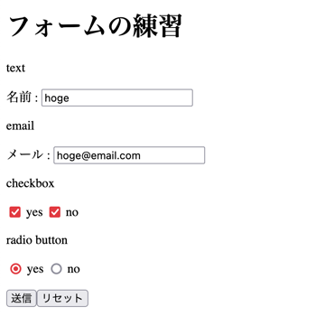

# 2022/06/05

## HTMLのformタグについて
HTMLのformタグの復習<br>
最近勉強しているflaskでHTMLとのデータの受け渡しでうろ覚えだったので、再確認

### formタグ
入力・送信フォームの作成に使う<br>
利用できる入力フォームの部品は、テキストボックス、ラジオボタン、チェックボックス、セレクトボタン等様々<br>
submitボタンを利用することにより、指定したURLに指定したメソッドでフォーム内容を送信することができる<br>
実際の利用ではセキュリティ等にも気を使う必要がある<br>

```
<form action="送信先のURL" method="httpメソッド">
    ...
    入力タグ達
    ...
</form>
```
### コード

```
<body>
    <h1>フォームの練習</h1>
    <form action="./form.html" method="get">
        <p>text</p>
        <div>
            <label for="name">名前 : </label>
            <input type="text" name="name" placeholder="なまえ">
        </div>
        <p>email</p>
        <div>
            <label for="email">メール : </label>
            <input type="email" name="email" placeholder="めーる">
        </div>
        <p>checkbox</p>
        <div>
            <label>
                <input type="checkbox" name="checkbox" value="yes"> yes
            </label>
            <label>
                <input type="checkbox" name="checkbox" value="no"> no
            </label>
        </div>
        <p>radio button</p>
        <div>
            <label>
                <input type="radio" name="radio" value="yes"> yes
            </label>
            <label>
                <input type="radio" name="radio" value="no"> no
            </label>
        </div>
        <p><input type="submit" value="送信"><input type="reset" value="リセット"></p>
    </form>
</body>
```

### 実際に使った様子
<!-- markdownの画像読み込みをしないと_imageディレクトリが作成されない -->
<br>
<!--  -->

`?name=hoge&email=hoge%40email.com&checkbox=yes&checkbox=no&radio=yes`<br>
がURLの後方に追加されているのがわかる(GET)<br>
テキストタイプのinputと被ってわかりずらいが、<br>
name=valurの形でそれぞれの値が&で連結されてデータとして送信されているのがわかる<br>
各言語によって受け取り方の差はあるものの、とりあえずnameプロパティとvalueプロパティが受け渡しに使われることがわかる。

### まとめ

formによるデータの渡し方を確認できた

## 検索用タグ
html, HTML, form

## 参考
- [html formタグ](http://www.htmq.com/html/form.shtml)
