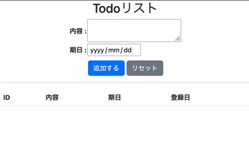
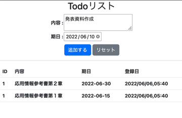

# 2022/06/06

## flaskでTodoリストの作成

独力でのflaskで簡単なWebサイトの作成が目標<br>
今回作成したのはログイン機能もデータベースもないTodoリスト<br>
データベースの代わりにjsonを利用してデータの保存をする<br>


### 必要な知識等
簡単なflaskの使い方<br>
pythonでのjsonの扱い<br>
htmlのformタグ<br>
bootstrapは申し訳程度

### コード

```
<!DOCTYPE html>
<html lang="ja">
<head>
    <meta charset="UTF-8">
    <meta http-equiv="X-UA-Compatible" content="IE=edge">
    <meta name="viewport" content="width=device-width, user-scalable=no, initial-scale=1.0, maximum-scale=1.0, minimum-scale=1.0">
    <link href="../static/main.css" rel="stylesheet">
    <link href="https://cdn.jsdelivr.net/npm/bootstrap@5.2.0-beta1/dist/css/bootstrap.min.css" rel="stylesheet">
    <title>To do リスト</title>
</head>
<body>
    <h1>Todoリスト</h1>
    <form action="/save" method="post">
        <table>
            <tr>
                <th>内容 : </th>
                <th><textarea name="todo"></textarea></th>
            </tr>
            <tr>
                <th>期日 : </th>
                <th><input type="date" name="end_date"></th>
            </tr>
            <!-- <tr>
                <th>締切時間 : </th>
                <th><input type="time" name="time"></th>
            </tr>
            <tr>
                <th>ステータス</th>
                <th>
                    <p>新規(未着手)<input type="radio" name="status" value="new"></p>
                    <p>実施中<input type="radio" name="status" value="doing"></p>
                    <p>延期<input type="radio" name="status" value="postponed"></p>
                    <p>完了<input type="radio" name="status" value="done"></p>
                </th>
            </tr> -->
        </table>
        <div class="button">
            <input type="submit" value="追加する" class="btn btn-primary">
            <input type="reset" value="リセット" class="btn btn-secondary">
        </div>
    </form>
    <hr>
    <table class="table">
        <tr>
            <th>ID</th>
            <!-- <th>ステータス</th> -->
            <th>内容</th>
            <th>期日</th>
            <!-- <th>締切時間</th> -->
            <th>登録日</th>
        </tr>
        
        <tr>
            <th>{{item.ID}}</th>
            <!-- <th>ステータス</th> -->
            <th>{{item.todo}}</th>
            <th>{{item.end_data}}</th>
            <!-- <th>締切時間</th> -->
            <th>{{item.created_at}}</th>
        </tr>
        
    </table>
</body>
</html>
```
./templates/index.html<br>
<br>
テンプレートエンジンを利用してpythonから変数を持ってきてレンダリングしているのは二つ目のtableだけ<br>
簡単な説明(上から)

- formタグを利用して、Todoの内容と期日をpostメソッドで取得する
- 二つ目のtableでは、app.pyでのテンプレートエンジンによるレンダリングの際に変数をHTMLに渡している
- formのaction属性は、python上で"/save"に飛ばして"/"へリダイレクトすることを考えていたのでこのようになっている
- 他にも色々な要素をつけたかったが次回の課題とする

```
h1{
    text-align: center;
}

table{
    margin:0 auto;
}

.button{
    /* text-align: center; */
    margin:10px auto;
    text-align: center;
}
```
./static/main.css<br>
<br>
申し訳程度にbootstrupを使って形を整えた<br>
センタリングだけmain.cssで行っている


```
import json
import datetime
from flask import Flask, render_template, request, redirect

DATABASE_FILE = 'todo.json'

app = Flask(__name__)

def save_data(id, todo, end_date, created_at):
    # ここで大まかな型なんかを決めているが、結局のところ書き込むときはstr
    """Todoリストのデータを保存する
    :param ID: ID
    :type ID: int
    :param todo: Todo内容
    :type todo: str 
    :param end_date: 期日 
    :type end_date: datetime.date
    :param created_at: 登録日 
    :type created_at: datetime.datetime
    """

    try:
        db = json.load(open(DATABASE_FILE, mode="r", encoding="utf-8"))
    except FileNotFoundError:
        db = []

    # jsonモジュールについて調べる
    # todo.jsonへのデータの挿入
    # リスト操作、インデクスをもつ要素(第一引数)の直前にこのデータを入れている
    db.insert(0,{
        "ID": id,
        "todo": todo,
        "end_data": end_date,
        "created_at": created_at.strftime("%Y/%m/%d,%H:%M"),
    })
    
    json.dump(db, open(DATABASE_FILE, mode="w", encoding="utf-8"), indent=4, ensure_ascii=False)

def load_data():
    # 途中の属性に抜けがあるとエラーを吐く
    try:
        db = json.load(open(DATABASE_FILE,mode="r", encoding="utf-8"))
    except FileNotFoundError:
        db = []
    return db

@app.route('/')
def index():
    todo_list = load_data()
    return render_template('index.html', todo_list=todo_list)

@app.route('/save', methods=['POST'])
def save():
    id = 1
    todo = request.form.get('todo')
    end_date = request.form.get('end_date')
    created_at = datetime.datetime.now()
    save_data(id, todo, end_date, created_at)
    print(end_date)
    print(type(end_date))
    return redirect('/')

if __name__ == "__main__":
    # データ挿入見本
    # end_date = datetime.date(2020, 6, 3)
    # created_at = datetime.datetime.now()
    # # print(end_date.strftime("%Y%m%d"))
    # # print(created_at.strftime("%Y%m%d,%H%M"))
    # save_data(1, '勉強する', end_date.strftime("%Y%m%d"), created_at)
    app.run(debug=True)
```
./app.py<br>
<br>
コーディングの順番

- JSON形式の扱いについて記述(save_data, load_data)
- 対話シェルもしくはmainにJSON挿入のコードを書いてJSONファイルに保存できるかを確認(main下のデータ挿入見本)
- htmlをテンプレートエンジンを用いてレンダリング(index()->この時は`return render_template("index.html")のみ)
- 仮で入れたデータがhtmlに反映されるか確認（index.htmlの二つ目のテーブルをテンプレート言語に変える、index()でJSONデータを変数として渡す）
- フォームからデータを受け取れることを確認(save())
- フォームのデータをJSONファイルに保存できるように変数名、型などを微調整

### 実際に使った様子（画像等）

<!-- 画像サイズを変更するために無理やり相対パスを通してる -->
<!-- PCだとちょうど2枚横並びで、スマホだと周りのスタイルを崩さないので360 -->
<!-- 
 -->




### まとめ

とりあえずWebサイトの見た目を作るセンスがなさすぎる<br>
今後の課題
- IDをうまく増加させ、IDをキーとして削除、編集ができるようにする
    - Jsonのへのデータ挿入、削除の方法を調べる
- 変数の命名やgitのcommitメッセージを書くときにだいぶ悩んだので、よく使うもの（登録日、開始日時、変更、修正、完了、実施中等）を調べておく

## 検索用タグ
flask, json, html, bootstrap

## 参考
- [Pythonプロフェッショナルプログラミング第３版](https://www.shuwasystem.co.jp/book/9784798053820.html)
- [コーディング命名規則一覧](https://murashun.jp/article/programming/naming-conventions.html)
- [変数名等の名前付け（個人的）](https://knooto.info/naming-variables/)