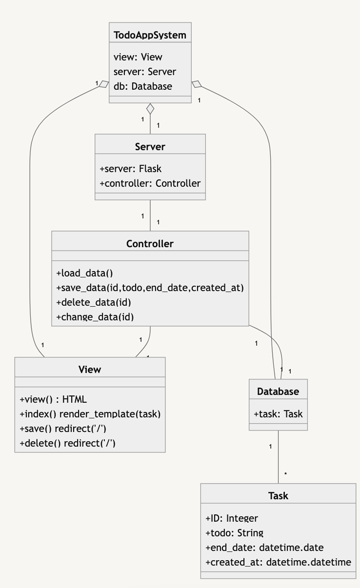

# 2022/06/08

## flaskで作ったtodoリストのクラス図 

2022/06/06に作成したtodoリストを改善すべくクラス図を作成<br>
クラス図をもとに今後プログラムの改善をできればいいと思う<br>

### 作成したクラス図
````
```{mermaid}
classDiagram
	direction TB
	class TodoAppSystem{
		view: View
		server: Server
		db: Database
	}
	class Task{
		+ID: Integer
		+todo: String
		+end_date: datetime.date
		+created_at: datetime.datetime
	}
	class View{
		+view() HTML
		+index() render_template(task)
		+save() redirect('/')
		+delete() redirect('/')
	}
	class Controller{
		+load_data()
		+save_data(id,todo,end_date,created_at)
		+delete_data(id)
		+change_data(id)
	}
	class Database{
		+task: Task
	}
	class Server{
		+server: Flask
		+controller: Controller
	}
	TodoAppSystem "1"o--"1" View
	TodoAppSystem "1"o--"1" Server
	TodoAppSystem "1"o--"1" Database
	Server "1"--"1" Controller
	Controller "1"--"1" Database
	Controller "1"--"1" View
	Database "1"--"*" Task
```
````

<!--  -->

### まとめ
過去に作成した映画館チケット予約システムのクラス図とMVCモデル<br>
をもとに作成したが、正直しっくりきていないので<br>
今後他のUML図を作成して、全体の整合性を測りプログラムを改善する

## 検索用タグ

flask, クラス図, webアプリ

## 参考
[mermaid](https://mermaid-js.github.io/mermaid/#/)