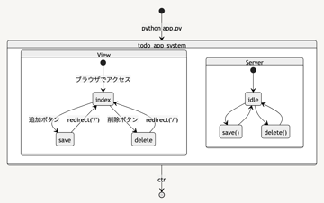

# 2022/06/09

## flaskで作ったtodoリストの状態遷移図 

2022/06/06に作成したtodoリストを改善すべく状態遷移図を作成<br>
状態遷移図をもとに今後プログラムの改善をできればいいと思う<br>

### 作成したクラス図
````
```{mermaid}
stateDiagram-v2
	[*] --> todo_app_system : python app.py
	todo_app_system --> [*] : ctr<c>
	state todo_app_system{
		View
		Server
	}
	state View{
		[*] --> index : ブラウザでアクセス
		index --> save : 追加ボタン
		save --> index : redirect('/')
		index --> delete : 削除ボタン
		delete --> index : redirect('/')
	}
	state Server{
		[*] --> idle
		idle --> save()
		idle --> delete()
		save() --> idle
		delete() --> idle
	}
```
````




### まとめ
クラス図に引き続き状態遷移図を作成<br>
できるだけクラス図と生合成の取れる状態遷移図を書こうと思ったが、うまくかけた気がしない<br>
今後他のUML図を作成して、全体の整合性を測りプログラムを改善する

## 検索用タグ

flask, 状態遷移図, webアプリ

## 参考
[mermaid](https://mermaid-js.github.io/mermaid/#/)