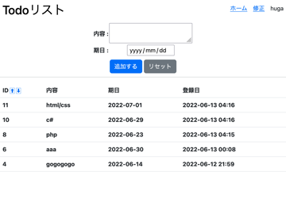
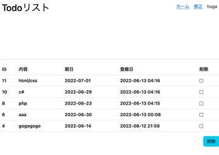

# 2022/06/13

## flask todo app

2022/06/06にflaskで作成したtodoアプリをさらに改良したもの<br>
具体的には、削除機能及びソート機能の追加をした<br>

### 前提知識等
2022/06/06のtodoリストアプリ<br>
2022/06/07のJSON形式の操作<br>
が分かれば作れるはず

### コード
```
import json
import datetime
from flask import Flask, render_template, request, redirect

DATABASE_FILE = 'todo_app.json'

app = Flask(__name__)

########## functions ##########

def load_data(sort_flag):
    # 途中の属性に抜けがあるとエラーを吐く
    try:
        db = json.load(open(DATABASE_FILE,mode="r", encoding="utf-8"))
    except FileNotFoundError:
        db = []
    if sort_flag == 1:
        db = sorted(db, key=lambda x:x['ID'])
    
    
    return db

def check_id():
    id = 0
    try:
        db = json.load(open(DATABASE_FILE,mode="r", encoding="utf-8"))
    except FileNotFoundError:
        db = []
    for i in range(len(db)):
        if db[i]["ID"] > id:
            id = db[i]["ID"]
    return id

def save_data(id, todo, end_date, created_at):
    # ここで大まかな型なんかを決めているが、結局のところ書き込むときはstr
    """Todoリストのデータを保存する
    :param ID: ID
    :type ID: int
    :param todo: Todo内容
    :type todo: str 
    :param end_date: 期日 
    :type end_date: datetime.date
    :param created_at: 登録日 
    :type created_at: datetime.datetime
    """

    try:
        db = json.load(open(DATABASE_FILE, mode="r", encoding="utf-8"))
    except FileNotFoundError:
        db = []

    # jsonモジュールについて調べる
    # todo.jsonへのデータの挿入
    # リスト操作、インデクスをもつ要素(第一引数)の直前にこのデータを入れている
    db.insert(0,{
        "ID": id,
        "todo": todo,
        "end_data": end_date,
        "created_at": created_at.strftime("%Y-%m-%d %H:%M"),
    })
    
    json.dump(db, open(DATABASE_FILE, mode="w", encoding="utf-8"), indent=4, ensure_ascii=False)

def delete_data(id):
    print("delete data")
    print(id)
    print(type(id))
    
    try:
        db = json.load(open(DATABASE_FILE, mode="r", encoding="utf-8"))
    except FileNotFoundError:
        db = []
    remove_list =[]
    # print(db[0]["ID"])
    # print(type(db[0]["ID"]))
    # print(db[0])
    for i in range(len(db)):
        print(i)
        if db[i]["ID"] == id:
            # ここでremoveしてしまうと、lenが合わなくなる
            # list index out of rangeエラーが出る
            # db.remove(db[i])
            remove_list.append(db[i])
    for i in range(len(remove_list)):
        db.remove(remove_list[i])
        
    json.dump(db, open(DATABASE_FILE, mode="w", encoding="utf-8"), indent=4, ensure_ascii=False)

def change_data(id):
    print("change data")

########## routing ##########

# sort_flag 
# 0 : 生JSON
# 1 : id昇順
# 2 : id降順
# 3 : end_date昇順
# 4 : end_date降順

# index
@app.route('/')
def index():
    sort_flag = 0
    todo_list = load_data(sort_flag)
    return render_template('index.html', todo_list=todo_list)

# sort id
@app.route('/sort_id')
def sort_id():
    sort_flag = 1
    todo_list = load_data(sort_flag)
    return render_template('index.html', todo_list=todo_list)

# modify data
@app.route('/modify')
def modify():
    sort_flag = 0
    todo_list = load_data(sort_flag)
    return render_template('modify.html', todo_list=todo_list)

# save data
@app.route('/save', methods=['POST'])
def save():
    id = check_id() + 1
    todo = request.form.get('todo')
    end_date = request.form.get('end_date')
    created_at = datetime.datetime.now()
    save_data(id, todo, end_date, created_at)
    print(end_date)
    print(type(end_date))
    return redirect('/')

# delete data
@app.route('/delete', methods=['POST'])
def delete():
    print('delete()')
    todo_id = request.form.getlist('todo_id')
    print(todo_id)
    for i in range(len(todo_id)):
        id = int(todo_id[i])
        delete_data(id)
    print(todo_id)
    return redirect('/')

if __name__ == "__main__":
    app.run(debug=True)
```
app.py<br>
<br>

サーバーサイドのプログラム本体<br>
sort_flagをもっと上手く使えるはず<br>
削除は複数選択できて、修正は単数選択が良いのでまた別の方法を考える必要がある<br>
実際に使われている他のサービスを参考にする必要がありそう<br>

```
<!DOCTYPE html>
<html lang="ja">
<head>
    <meta charset="UTF-8">
    <meta http-equiv="X-UA-Compatible" content="IE=edge">
    <meta name="viewport" content="width=device-width, user-scalable=no, initial-scale=1.0, maximum-scale=1.0, minimum-scale=1.0">
    <link href="../static/main.css" rel="stylesheet">
    <link href="https://cdn.jsdelivr.net/npm/bootstrap@5.2.0-beta1/dist/css/bootstrap.min.css" rel="stylesheet">
    <title>To do リスト</title>
</head>
<body>
    <header>
        <h1><a href="/">Todoリスト</a></h1>
        <nav class="pc-nav">
            <ul>
                <li><a href="/">ホーム</a></li>
                <li><a href="/modify">修正</a></li>
                <li>huga</li>
            </ul>
        </nav>
    </header>
    
    <hr class="content-border">
    
</body>
</html>
```
layout.html<br>
<br>

Jinjaのテンプレート用html<br>
header部分は他のページでも利用している<br>

```



<form action="/save" method="post">
    <div class="form_table">
        <table>
            <tr>
                <th>内容 : </th>
                <th><textarea name="todo"></textarea></th>
            </tr>
            <tr>
                <th>期日 : </th>
                <th><input type="date" name="end_date"></th>
            </tr>
            <!-- <tr>
                <th>締切時間 : </th>
                <th><input type="time" name="time"></th>
            </tr>
            <tr>
                <th>ステータス</th>
                <th>
                    <p>新規(未着手)<input type="radio" name="status" value="new"></p>
                    <p>実施中<input type="radio" name="status" value="doing"></p>
                    <p>延期<input type="radio" name="status" value="postponed"></p>
                    <p>完了<input type="radio" name="status" value="done"></p>
                </th>
            </tr> -->
        </table>
        <div class="button">
            <input type="submit" value="追加する" class="btn btn-primary">
            <input type="reset" value="リセット" class="btn btn-secondary">
        </div>
    </div>
</form>




<form action="/delete" method="post">
    <table class="table">
        <tr>
            <th>ID <a class="arrows" href="/sort_id">&#x2b06;</a> <a class="arrows" href="/sort_id">&#x2b07;</a> </th>
            <!-- <th>ステータス</th> -->
            <th>内容</th>
            <th>期日</th>
            <!-- <th>締切時間</th> -->
            <th>登録日</th>
        </tr>
        
        <tr>
            <th>{{item.ID}}</th>
            <!-- <th>ステータス</th> -->
            <th>{{item.todo}}</th>
            <th>{{item.end_data}}</th>
            <!-- <th>締切時間</th> -->
            <th>{{item.created_at}}</th>
        </tr>
        
    </table>
</form>


```
index.html<br>
<br>

いわゆるホーム画面<br>

```



<form action="/delete" method="post">
    <table class="table">
        <tr>
            <th>ID</th>
            <!-- <th>ステータス</th> -->
            <th>内容</th>
            <th>期日</th>
            <!-- <th>締切時間</th> -->
            <th>登録日</th>
            <th class="th-delete">削除</th>
        </tr>
        
        <tr>
            <th>{{item.ID}}</th>
            <!-- <th>ステータス</th> -->
            <th>{{item.todo}}</th>
            <th>{{item.end_data}}</th>
            <!-- <th>締切時間</th> -->
            <th>{{item.created_at}}</th>
            <th class="th-delete"><input type="checkbox" name="todo_id" value="{{item.ID}}"></th>
        </tr>
        
    </table>
<input type="submit" value="削除" class="btn btn-info" style="float:right ;">
</form>

```
modify.html<br>
<br>

いわゆる編集画面<br>

```
/* *{
    border:1px solid red;
} */

header{
    height: 64px;
    width: 100%;
    padding: 24px 8px;
    background-color: #fff;
    display: flex;
    align-items: center;
    position: fixed;
    top: 0px;
    z-index: 100;
}

h1 a{
    text-align: center;
    text-decoration: none;
    color: black;
}

nav{
    margin:0 0 0 auto;
}

ul{
    list-style-type:none ;
    display: flex;
}

li{
    margin-left: 16px;
}

.form_table{
    width: 100%;
    position: fixed;
    margin: 64px auto 0px auto;
    top:0px;
    text-align: center;
    background-color: #fff;
    z-index: 100;
}

table{
    margin:0 auto;
}

.content-border{
    margin-top: 214.5px ;
}

.arrows{
    font-size: 12px;
    text-decoration: none;
    border: solid 0.5px ;
    /* color: black; */
}

.button{
    /* text-align: center; */
    margin:10px auto;
    text-align: center;
}

.th-delete{
    width: 80px;
}
```
main.css<br>
<br>

スタイルシート<br>

### 実際に使った様子（画像等）



### まとめ
ある程度サーバーサイドの仕組みを作るのはできるようになってきた<br>
なんだかんだでUIの部分が問題になってきて思考を阻害するので、簡単なUIのサンプルを調査、作成しておくべき<br>

## 検索用タグ
flask, json, webアプリ

## 参考