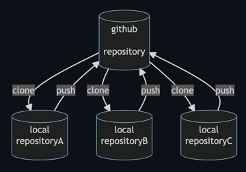
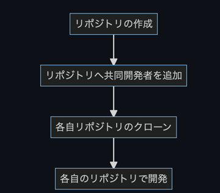
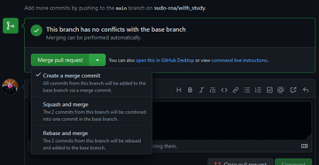
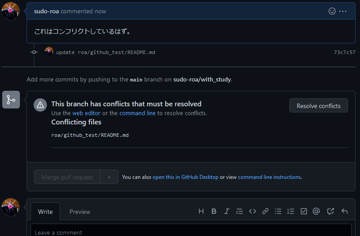
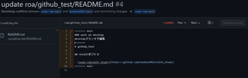
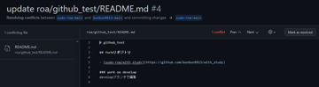
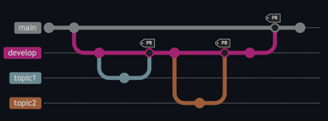
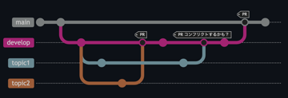
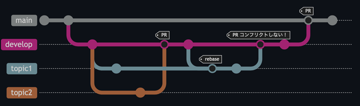

# 2022/06/29

## 共同開発について
一つのリポジトリを共同開発者がcloneして共同開発を行うケース[case1]について<br>
おおもとのリポジトリを共同開発者がforkして各リポジトリで開発を行うケース[case2]もあるが、今回は[case1]についてのみ<br>
ここで言うcloneのみでの共同開発は、一つのリポジトリを各共同開発者がクローンすることで、<br>
自由にプッシュ、マージなどができる方法である<br>
<br>

### [case1]の選択基準
- 簡単な開発
- 知り合い同士での開発
- 少人数での共同開発
- Gitの取り扱いに不慣れな人がいる

### [case1]の流れ
1. 共同開発用リポジトリの作成
2. 共同開発用リポジトリへのコラボレーターの追加
3. 各開発者がリポジトリをクローン
4. 各開発者がクローンしたリポジトリでブランチを切って開発

⚠️開発は連携を密にとる必要がある<br>
話し合いで共同開発者が順番に作業を行えたらめんどくさいことは起こらないので。<br>
<br>

### [case1]でのgit操作の例
#### リポジトリのクローンからブランチを切って開発しプッシュするまでのコマンドライン上での操作例
```bash
$ git clone https://github.com/GITHUB_USERNAME/REPOSITORY_NAME.git

# developブランチで開発をする場合
$ git checkout -b develop

# at develop
$ git add FILENAME
$ git commit -m "COMMIT MESSAGE"
$ git push origin develop
$ git checkout main

# at main
$ git merge develop
$ git push
or github上でプルリクエストの作成->merge
```

#### ブラウザ上のgithub UIでプルリクエストを作成してマージする方法
変更したリポジトリ上でpull requests > New pull request > マージするリポジトリ(ブランチ), マージされるリポジトリ(ブランチ)を選択 > create pull request<br>
Merge pull requestでマージ<br>
<br>

コンフリクトが発生すると、↓のような画面が出る<br>
<br>

Resolve conflictsを押すと、コンフリクト解消のための画面が表示される<br>
\> : マージ先のリポジトリ(ブランチ)<br>
\< : マージ元のリポジトリ(ブランチ)<br>
<br>

差分を確認しながら編集して、編集が完了したらmark as resolvedを押す<br>
<br>
後は通常通りマージするだけ<br>


#### 複数の開発者が順番に作業を行う場合
順番に開発作業を行えればコンフリクトも発生せずうまくいく<br>
<br>

#### 複数の開発者が並行して作業をしている場合
順番に開発作業を行うことは現実的に難しい<br>
開発者が並行して作業する場合、いかに話し合いをうまく進めてもリポジトリ上での問題発生は避けられない<br>
コンフリクトが発生すると無駄な工程が増えてしまうので起こらない工夫が大切<br>
<br>

直前にリベースをすることによってコンフリクトを事前に避ける<br>
rebaseの部分だけどんなコマンドを使うか例を挙げる
```bash
$ git checkout topic1
$ git pull --rebase origin develop
```
<br>

## まとめ
githubで行う共同開発のうち、一つのリポジトリを共同開発者がcloneして共同開発を行うケースについて調べた<br>
[case2]についてはまた今度まとめる<br>

## 参考
- [CloneとFork、チーム開発する際にはどっちを使うべき？](https://techtechmedia.com/clone-fork-difference/)
- [サル先生のGit入門 5.並行で作業する](https://backlog.com/ja/git-tutorial/stepup/11/)
- [Github Docs コレボレーターを個人リポジトリに招待する](https://docs.github.com/ja/account-and-profile/setting-up-and-managing-your-personal-account-on-github/managing-access-to-your-personal-repositories/inviting-collaborators-to-a-personal-repository)
- [git コンフリクト解決(rebase)](https://m-tmatma.github.io/git/ResolveConflictByRebase.html)
