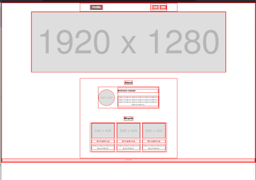

# 2022/06/17

## codestep profile
codestepのprofileサイト作成を通して学んだことを振り返る

### 作成したコード
```
<!DOCTYPE html>
<html lang="ja">

<head>
    <meta charset="UTF-8">
    <meta http-equiv="X-UA-Compatible" content="IE=edge">
    <meta name="viewport" content="width=device-width, initial-scale=1.0">
    <link rel="shortcut icon" href="./images/favicon.ico">
    <link href="https://unpkg.com/sanitize.css" rel="stylesheet">
    <link rel="stylesheet" href="./style/style.css">
    <title>Profile</title>
</head>

<body>
    <!-- 独立ブロックheader -->
    <header class="header">
        <h1 class="header__logo"><a class="header__link--white" href="./index.html">Profile</a></h1>
        <nav>
            <ul class="header__ul">
                <li class="header__list"><a class="header__link--black" href="#about">About</a></li>
                <li class="header__list"><a class="header__link--black" href="#bicycle">Bicycle</a></li>
            </ul>
        </nav>
    </header>
    <!-- 独立ブロックmainvisual -->
    <div class="mainvisual">
        
    </div>
    <!-- 独立ブロックcontent -->
    <div class="content">
        <h2 id="about" class="content__title">About</h2>
        <!-- 独立ブロックabout -->
        <div class="about">
            
            <div class="about__texts">
                <h3 class="about__texts__title">WATASHI NAMAE</h3>
                <p class="about__texts__text">
                    テキストテキストテキストテキストテキスト
                    テキストテキストテキストテキストテキスト
                    テキストテキストテキストテキストテキスト
                    テキストテキストテキストテキストテキスト
                </p>
            </div>
        </div>
        <h2 id="bicycle" class="content__title">Bicycle</h2>
        <!-- 独立ブロックarticle -->
        <div class="article">
            <div class="article__list">
                
                <p class="article__title">タイトルタイトル</p>
                <p class="article__text">
                    テキストテキストテキストテキストテキスト
                </p>
            </div>

            <div class="article__list">
                
                <p class="article__title">タイトルタイトル</p>
                <p class="article__text">
                    テキストテキストテキストテキストテキスト
                </p>
            </div>

            <div class="article__list">
                
                <p class="article__title">タイトルタイトル</p>
                <p class="article__text">
                    テキストテキストテキストテキストテキスト
                </p>
            </div>

        </div>
    </div>
    
    <footer>
        <p>&copy 2022 sudo-roa</p>
    </footer>
</body>

</html>
```
index.html<br>
<br>

```
*{
    border: 1px solid red;
}

body{
    width: 100%;
}

/* header */
header{
    max-width: 960px;
    display: flex;
    margin: 0 auto;
    align-items: center;
    padding:0 4%;
    justify-content: space-between;
}

.header__logo{
    background-color: gray;
    font-weight: 800;
    font-size: 24px;
    padding: 4px 16px;
}

nav{
    display: flex;
    margin: 0 0 0 auto;
}

.header__ul{
    display: flex;
}

.header__list{
list-style-type: none;
margin-left: 16px;
display: flex;
}

.header__list:hover{
    opacity: 0.6;
}

.header__link--white{
    text-decoration: none;
    color: #fff;
}

.header__link--black{
    text-decoration: none;
    color: black;
}

/* mainvisual */
.mainvisual{
    width: 100%;
    max-width: 1920px;
    max-height: 600px;
    margin: 0 auto 60px auto;
}

.mainvisual__image{
    object-fit: cover;
    width: 100%;
    max-width: 1920px;
    max-height: 600px;
}

/* content */
.content{
    max-width: 960px;
    display:flex;
    align-items: center;
    flex-direction: column;
    margin: 0 auto;
    padding:0 4%;
    text-align: center;
}

.content__title{
    display: inline-block;
    text-align: center;
    border-bottom: 1px solid black;
}

/* about */
.about{
    max-width: 600px;
    display: flex;
    margin-bottom: 60px;
}

.about__image{
    width: 160px;
    height: 160px;    
    border-radius: 100%;
    margin: auto 0;
}

.about__texts{
    display: flex;
    flex-direction: column;
    margin-left: 30px;
}

.about__texts__title{
    font-weight: bold;
    display: block;
    text-align: left;
}

.about__texts__text{
    display: block;
}

/* article */
.article{
    max-width: 960px;
    display: flex;
    justify-content: space-between;
    margin-bottom: 60px;
}

.article__list{
    margin: 0 10px;
}

.article__list img{
    width:100%;
    object-fit: cover;
    justify-content: center;
}

.article__title{
    font-weight: bold;
}

/* footer */
footer{
    text-align: center;
}

footer p{
    font-size: 8px;
}


@media screen and (max-width: 600px){
    .about{
        flex-direction: column;
    }
    
    .about__image{
        margin: 0 auto;
    }

    .about__texts{
        margin-left: 0;
    }

    .article{
        flex-direction: column;
    }

    .article__list{
        width: 100%;
        margin: 0;
    }

}
```
style.css<br>
<br>

### サイトの様子


### 学んだこと
- HTML
    - faviconの設定方法
    - HTMLのクラスの命名方法(BEM)
    - copyrightの書き方(その他の特殊な記号も)
- CSS
    - 要素の外枠がわかりやすいように全要素に枠をつけてしまう
    - flexの使い方(デフォルトの特性と縦並び)
    - flex要素のセンタリング
    - flex要素の均等配置
    - aタグのデコレーション解除
    - imgを親タグのサイズに収める方法
    - madia queryが効かない!?!?問題(andの後の半角スペース)

## 検索用タグ
HTML, CSS, Codestep

## 参考
- [codestep](https://code-step.com/)
- [【命名規則】BEMを使った書き方についてまとめてみた【CSS】](https://qiita.com/takahirocook/items/01fd723b934e3b38cbbc)

