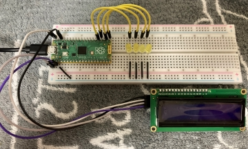

# 2022/07/25

## raspberry pi picoでLちか+α

### 使用機材
- raspbrry pi pico × 1
- LED × 4
- LCD1602 × 1
- ブレッドボード × 1

### 配線方法
 

- LCD1602 -> pico
    - GND -> GND
    - VCC ->
    - SDA ->
    - SCL ->

- LED(4つ) -> pico
    - (-) -> GND
    - (+) -> GPIO(16,17,18,19)
        - 0bit目のLED -> 16
        - 1bit目のLED -> 17
        - 2bit目のLED -> 18
        - 3bit目のLED -> 19

### プログラム
lcd1602へのI2C通信用のライブラリはsunfounderのチュートリアルのものを利用(lcd1602.py) 

### 簡単な実行方法
1. 上記の通り配線する
2. thonnyを起動する
3. bootselボタンを押しながらPICOをPCに接続する
4. thonny上でPICOのファームウェアをインストールする
5. PICO上にライブラリファイル(lcd1602.py)を保存する
6. PC上でプログラム(num_counter.py)を実行する

## 参考
- [SunFounder](https://www.sunfounder.com)
- [sudo-roa/pico-practice/num_counter](https://github.com/sudo-roa/pico-practice/tree/main/num_counter)
